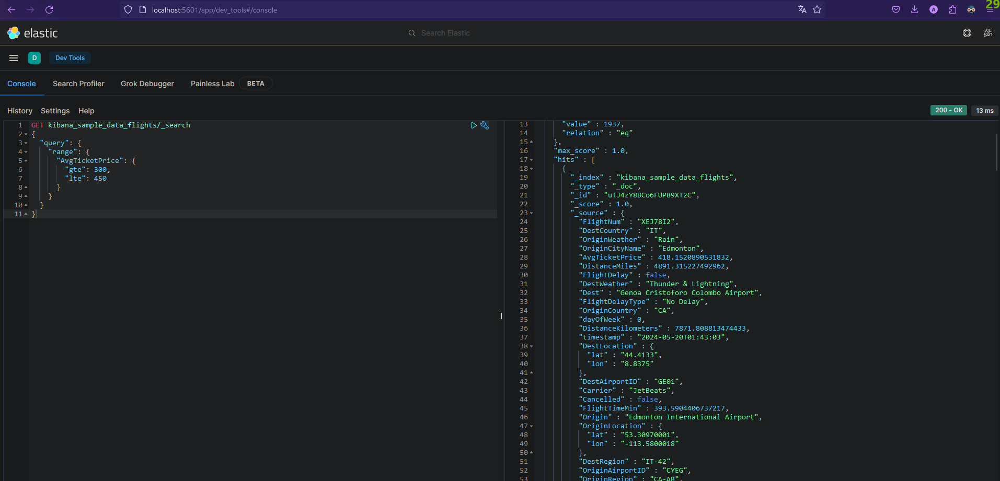
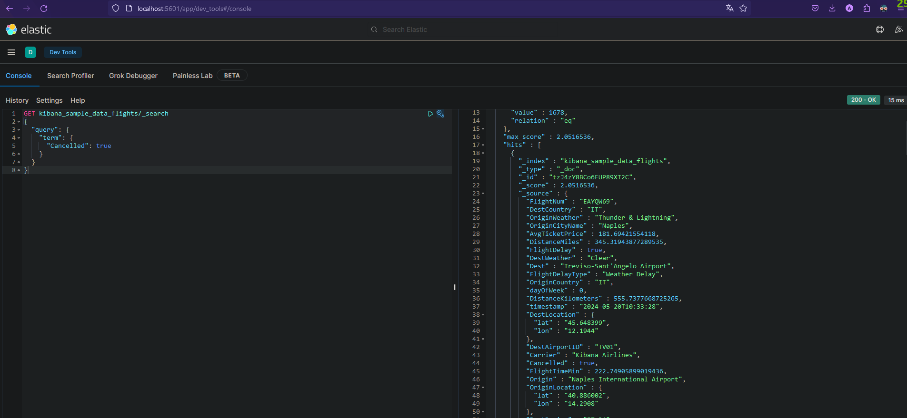
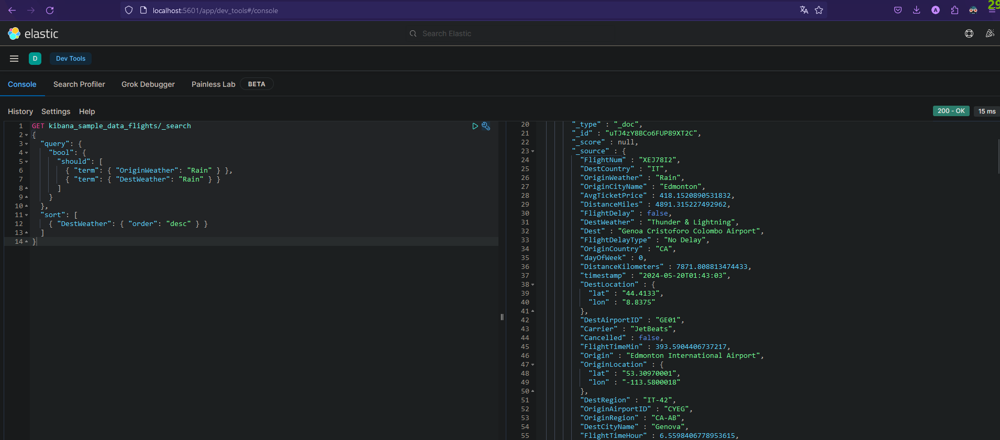
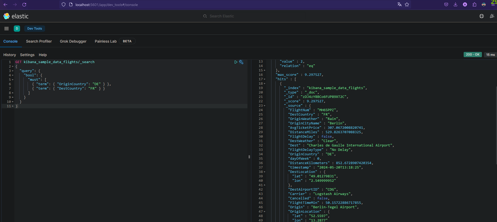
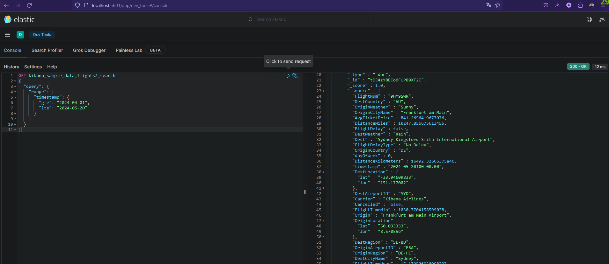

# Elasticsearch & Kibana

## Partie 1 : Installation et Configuration du Cluster Elasticsearch

Pour cette partie, nous allons installer et configurer un cluster Elasticsearch avec docker.
Afin de réaliser cette tâche, nous avons utilisé le docker-compose suivant :

```yaml
version: '3.8'
services:
  es-node1:
    image: docker.elastic.co/elasticsearch/elasticsearch:7.14.0
    container_name: es-node1
    environment:
      - node.name=es-node1
      - cluster.name=es-docker-cluster
      - discovery.seed_hosts=es-node2,es-node3
      - cluster.initial_master_nodes=es-node1,es-node2,es-node3
      - bootstrap.memory_lock=true
      - "ES_JAVA_OPTS=-Xms512m -Xmx512m"
    ulimits:
      memlock:
        soft: -1
        hard: -1
    volumes:
      - esdata1:/usr/share/elasticsearch/data
    ports:
      - 9200:9200
    networks:
      - esnet
  es-node2:
    image: docker.elastic.co/elasticsearch/elasticsearch:7.14.0
    container_name: es-node2
    environment:
      - node.name=es-node2
      - cluster.name=es-docker-cluster
      - discovery.seed_hosts=es-node1,es-node3
      - cluster.initial_master_nodes=es-node1,es-node2,es-node3
      - bootstrap.memory_lock=true
      - "ES_JAVA_OPTS=-Xms512m -Xmx512m"
    ulimits:
      memlock:
        soft: -1
        hard: -1
    volumes:
      - esdata2:/usr/share/elasticsearch/data
    networks:
      - esnet
  es-node3:
    image: docker.elastic.co/elasticsearch/elasticsearch:7.14.0
    container_name: es-node3
    environment:
      - node.name=es-node3
      - cluster.name=es-docker-cluster
      - discovery.seed_hosts=es-node1,es-node2
      - cluster.initial_master_nodes=es-node1,es-node2,es-node3
      - bootstrap.memory_lock=true
      - "ES_JAVA_OPTS=-Xms512m -Xmx512m"
    ulimits:
      memlock:
        soft: -1
        hard: -1
    volumes:
      - esdata3:/usr/share/elasticsearch/data
    networks:
      - esnet
  kibana:
    image: docker.elastic.co/kibana/kibana:7.14.0
    container_name: kibana
    ports:
      - 5601:5601
    environment:
      ELASTICSEARCH_HOSTS: "http://es-node1:9200"
    networks:
      - esnet
volumes:
  esdata1:
    driver: local
  esdata2:
    driver: local
  esdata3:
    driver: local
networks:
  esnet:
```

Lançons le cluster Elasticsearch avec la commande suivante :

```bash
docker-compose up
```

## Partie 2 : Premiers Pas avec le Cluster Elasticsearch

1. Créer un index nommé test01

```bash
curl -XPUT "http://localhost:9200/test01"
```

2. Vérifier que cet index est maintenant présent

```bash
curl -XGET "http://localhost:9200/_cat/indices?v"
```

3. Créer ce document dans cet index

```bash
curl -XPUT "http://localhost:9200/test01/_doc/1" -H 'Content-Type: application/json' -d'@datas.json'
```

datas.json :

```json
{
  "titre": "Premier document",
  "description": "C'est la première fois que je crée un document dans ES.",
  "quantité": 12,
  "date_creation": "10-05-2024"
}
```

4. Afficher ce document

```bash
curl -XGET "http://localhost:9200/test01/_doc/1"
```

Résultat :

```json
{
  "_index": "test01",
  "_type": "_doc",
  "_id": "1",
  "_version": 1,
  "_seq_no": 0,
  "_primary_term": 1,
  "found": true,
  "_source": {
    "titre": "Premier document",
    "description": "C'est la première fois que je crée un document dans ES.",
    "quantité": 12,
    "date_creation": "10-05-2024"
  }
}
```

5. Afficher quel mapping a été appliqué par défaut. Est-il optimal ?

```bash
curl -XGET "http://localhost:9200/test01/_mapping"
```

Résultat :

```json
{
  "test01": {
    "mappings": {
      "properties": {
        "date_creation": {
          "type": "text",
          "fields": {
            "keyword": {
              "type": "keyword",
              "ignore_above": 256
            }
          }
        },
        "description": {
          "type": "text",
          "fields": {
            "keyword": {
              "type": "keyword",
              "ignore_above": 256
            }
          }
        },
        "quantité": {
          "type": "long"
        },
        "titre": {
          "type": "text",
          "fields": {
            "keyword": {
              "type": "keyword",
              "ignore_above": 256
            }
          }
        }
      }
    }
  }
}
```

Le mapping par défaut n'est pas optimal pour le champ `date_creation` qui devrait être de type `date`.

6. Essayer de modifier le mapping pour le champ `date_creation`, pour un plus adapté

```bash
curl -XPUT "http://localhost:9200/test01/_mapping" -H "Content-Type: application/json" -d@mapping.json
```

Le mapping ne peut pas être modifié après la création de l'index.

7. Créer un nouvel index test02

```bash
curl -XPUT "http://localhost:9200/test02"
```

8. Appliquer un mapping plus adapté aux données du document ci-dessus

```bash
curl -XPUT "http://localhost:9200/test02/_mapping" -H 'Content-Type: application/json' -d@mapping.json
```

mapping.json :

```json
{
  "properties": {
    "titre": {
      "type": "text"
    },
    "description": {
      "type": "text"
    },
    "quantité": {
      "type": "long"
    },
    "date_creation": {
      "type": "date",
      "format": "dd-MM-yyyy"
    }
  }
}
```

8-2. Insérer les mêmes données

```bash
curl -XPUT "http://localhost:9200/test02/_doc/1" -H 'Content-Type: application/json' -d@datas.json
```

8-3. Afficher ce document

```bash
curl -XGET "http://localhost:9200/test02/_doc/1"
```

Résultat :

```json
{
  "_index": "test02",
  "_type": "_doc",
  "_id": "1",
  "_version": 1,
  "_seq_no": 0,
  "_primary_term": 1,
  "found": true,
  "_source": {
    "titre": "Premier document",
    "description": "C'est la première fois que je crée un document dans ES.",
    "quantité": 12,
    "date_creation": "10-05-2024"
  }
}
```

8-4. Afficher le mapping

```bash
curl -XGET "http://localhost:9200/test02/_mapping"
```

Résultat :

```json
{
  "test02": {
    "mappings": {
      "properties": {
        "date_creation": {
          "type": "date",
          "format": "dd-MM-yyyy"
        },
        "description": {
          "type": "text"
        },
        "quantité": {
          "type": "long"
        },
        "titre": {
          "type": "text"
        }
      }
    }
  }
}
```

9. Afficher la manière dont le texte de la description du document a été traité par l'analyzer

```bash
curl -XPOST "http://localhost:9200/test02/_analyze" -H 'Content-Type: application/json' -d@analyze.json
```

analyze.json :

```json
{
  "text": "C'est la première fois que je crée un document dans ES."
}
```

Résultat :

```json
{
  "tokens": [
    {
      "token": "c'est",
      "start_offset": 0,
      "end_offset": 5,
      "type": "<ALPHANUM>",
      "position": 0
    },
    {
      "token": "la",
      "start_offset": 6,
      "end_offset": 8,
      "type": "<ALPHANUM>",
      "position": 1
    },
    {
      "token": "première",
      "start_offset": 9,
      "end_offset": 17,
      "type": "<ALPHANUM>",
      "position": 2
    },
    {
      "token": "fois",
      "start_offset": 18,
      "end_offset": 22,
      "type": "<ALPHANUM>",
      "position": 3
    },
    {
      "token": "que",
      "start_offset": 23,
      "end_offset": 26,
      "type": "<ALPHANUM>",
      "position": 4
    },
    {
      "token": "je",
      "start_offset": 27,
      "end_offset": 29,
      "type": "<ALPHANUM>",
      "position": 5
    },
    {
      "token": "crée",
      "start_offset": 30,
      "end_offset": 34,
      "type": "<ALPHANUM>",
      "position": 6
    },
    {
      "token": "un",
      "start_offset": 35,
      "end_offset": 37,
      "type": "<ALPHANUM>",
      "position": 7
    },
    {
      "token": "document",
      "start_offset": 38,
      "end_offset": 46,
      "type": "<ALPHANUM>",
      "position": 8
    },
    {
      "token": "dans",
      "start_offset": 47,
      "end_offset": 51,
      "type": "<ALPHANUM>",
      "position": 9
    },
    {
      "token": "es",
      "start_offset": 52,
      "end_offset": 54,
      "type": "<ALPHANUM>",
      "position": 10
    }
  ]
}
```

10. Créer un index test03

```bash
curl -XPUT "http://localhost:9200/test03"
```

11. Appliquer un mapping plus adapté aux données du document ci-dessus

```bash
curl -XPUT "http://localhost:9200/test03/_mapping" -H 'Content-Type: application/json' -d'
{
  "properties": {
    "titre": {
      "type": "text"
    },
    "description": {
      "type": "text"
    },
    "quantité": {
      "type": "long"
    },
    "date_creation": {
      "type": "date",
      "format": "dd-MM-yyyy"
    }
  }
}
'
```

12. Insérer les mêmes données

```bash
curl -XPUT "http://localhost:9200/test03/_doc/1" -H 'Content-Type: application/json' -d'
{
  "titre": "Premier document",
  "description": "C est la première fois que je crée un document dans ES.",
  "quantité": 12,
  "date_creation": "10-05-2024"
}
'
```

13. Indexer la description en supprimant les mots sans valeur ajoutée

```bash
curl -XPOST "http://localhost:9200/test03/_close"
curl -XPUT "http://localhost:9200/test03/_settings" -H 'Content-Type: application/json' -d @settings.json
curl -XPOST "http://localhost:9200/test03/_open"
```

settings.json :

```json
{
  "settings": {
    "analysis": {
      "analyzer": {
        "my_french_analyzer": {
          "tokenizer": "standard",
          "filter": [
            "french_stop"
          ]
        }
      },
      "filter": {
        "french_stop": {
          "type": "stop",
          "stopwords": "_french_"
        }
      }
    }
  }
}
```

Afficher la manière dont le texte de la description du document a été traité par l'analyzer

```bash
curl -XPOST "http://localhost:9200/test03/_analyze" -H 'Content-Type: application/json' -d' { "analyzer": "my_french_analyzer", "text": "C est la première fois que je crée un document dans ES." } '
```

Résultat :

```json
{
  "tokens": [
    {
      "token": "C",
      "start_offset": 0,
      "end_offset": 1,
      "type": "<ALPHANUM>",
      "position": 0
    },
    {
      "token": "première",
      "start_offset": 9,
      "end_offset": 17,
      "type": "<ALPHANUM>",
      "position": 3
    },
    {
      "token": "fois",
      "start_offset": 18,
      "end_offset": 22,
      "type": "<ALPHANUM>",
      "position": 4
    },
    {
      "token": "crée",
      "start_offset": 30,
      "end_offset": 34,
      "type": "<ALPHANUM>",
      "position": 7
    },
    {
      "token": "document",
      "start_offset": 38,
      "end_offset": 46,
      "type": "<ALPHANUM>",
      "position": 9
    },
    {
      "token": "ES",
      "start_offset": 52,
      "end_offset": 54,
      "type": "<ALPHANUM>",
      "position": 11
    }
  ]
}
```

On remarque que les mots sans valeurs ajoutées ont été supprimés.

14. Importer plusieurs documents en une seule requête

```bash
curl -XPOST "http://localhost:9200/test03/_bulk" -H 'Content-Type: application/json' -d'
{ "index" : { "_index" : "test03", "_id" : "1" } }
{ "titre": "Doc 1", "description": "Description du document 1" }
{ "index" : { "_index" : "test03", "_id" : "2" }
{ "titre": "Doc 2", "description": "Description du document 2" }
{ "index" : { "_index" : "test03", "_id" : "3" }
{ "titre": "Doc 3", "description": "Description du document 3" }
{ "index" : { "_index" : "test03", "_id" : "4" }
{ "titre": "Doc 4", "description": "Description du document 4" }
'
```

## Partie 3 : Intégration de Kibana
La configuration du docker-compose permet de lancer un cluster Elasticsearch et un serveur Kibana.

1. Pour peupler le cluster, rendons-nous sur Kibana à l'adresse `http://localhost:5601`.
On y trouvera une section `Dashboard` qui nous permettra d'ajouter les données sur les vols.
2. Lister les vols dont le prix moyen est entre 300€ et 450€ :

```json
GET kibana_sample_data_flights/_search
{
  "query": {
    "range": {
      "AvgTicketPrice": {
        "gte": 300,
        "lte": 450
      }
    }
  }
}
```



3. Lister les vols annulés :

```json
GET kibana_sample_data_flights/_search
{
  "query": {
    "term": {
      "Cancelled": true
    }
  }
}
```



4. Lister les vols où il pleut à l'arrivée ou au départ :

```json
GET kibana_sample_data_flights/_search
{
  "query": {
    "bool": {
      "should": [
        { "term": { "OriginWeather": "Rain" } },
        { "term": { "DestWeather": "Rain" } }
      ]
    }
  },
  "sort": [
    { "DestWeather": { "order": "desc" } }
  ]
}
```



5. Lister les vols partant d'Allemagne et à destination de France :

```json
GET kibana_sample_data_flights/_search
{
  "query": {
    "bool": {
      "must": [
        { "term": { "OriginCountry": "DE" } },
        { "term": { "DestCountry": "FR" } }
      ]
    }
  }
}
```



6. Lister les vols ayant eu lieu entre le 1er avril 2024 et le 20 mai 2024 :

```json
GET kibana_sample_data_flights/_search
{
  "query": {
    "range": {
      "timestamp": {
        "gte": "2024-04-01",
        "lte": "2024-05-20"
      }
    }
  }
}
```

